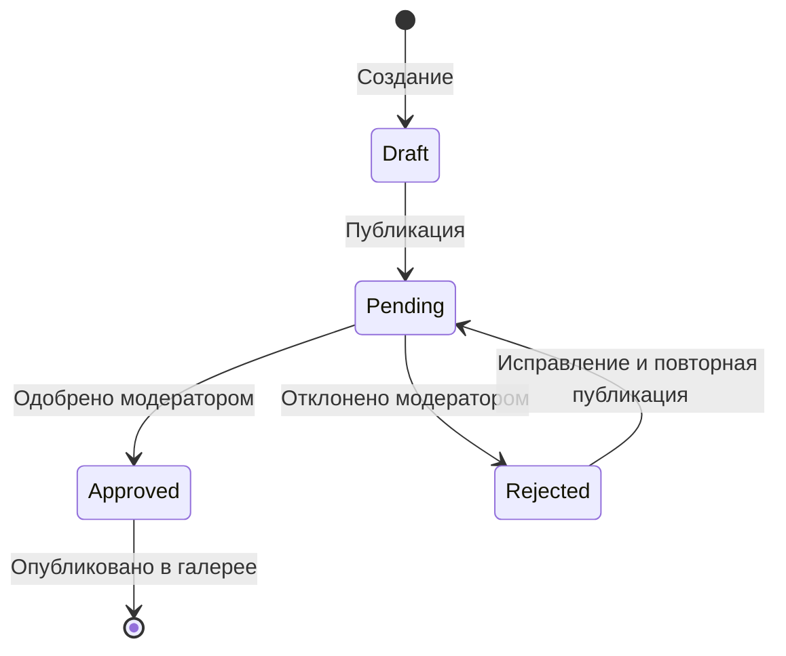

# 🛡️ Руководство по модерации скетчей

**Версия:** 0.5.3  
**Дата:** 22 марта 2026 г.  
**Статус:** ✅ Реализовано (Этап 5)

---

## 📋 Оглавление

1. [Обзор функционала](#обзор-функционала)
2. [Архитектура](#архитектура)
3. [Настройка ролей пользователей](#настройка-ролей-пользователей)
4. [Использование админ-панели](#использование-админ-панели)
5. [Workflow модерации](#workflow-модерации)
6. [RLS политики безопасности](#rls-политики-безопасности)
7. [API функции](#api-функции)
8. [Тестирование](#тестирование)
9. [Устранение неполадок](#устранение-неполадок)

---

## Обзор функционала

Система модерации позволяет модераторам и администраторам проверять, одобрять и отклонять скетчи, загруженные пользователями.

### Возможности

- ✅ **Просмотр скетчей на модерации** — список всех скетчей со статусом `pending`
- ✅ **Детальный просмотр** — код, описание, метаданные, информация об авторе
- ✅ **Одобрение скетча** — перевод в статус `approved` с комментарием
- ✅ **Отклонение скетча** — перевод в статус `rejected` с указанием причины
- ✅ **Логирование действий** — запись всех действий модерации в `sketch_moderation_logs`
- ✅ **Защита через RLS** — только модераторы и администраторы могут управлять скетчами

### Статусы скетчей

| Статус | Описание | Видимость в галерее |
|--------|----------|---------------------|
| `pending` | На модерации | ❌ Нет |
| `approved` | Одобрён | ✅ Да |
| `rejected` | Отклонён | ❌ Нет |
| `draft` | Черновик | ❌ Нет |

---

## Архитектура

### Компоненты

```
src/
├── views/
│   └── AdminDashboard.vue      # Админ-панель модератора
├── composables/
│   └── useSketches.ts          # Функции модерации (approve, reject, logs)
│   └── useAuth.ts              # Проверка ролей (isModerator, isAdmin)
├── components/
│   └── UserProfile.vue         # Ссылка на админ-панель для модераторов
└── router/
    └── index.ts                # Защита маршрута /admin
```

### Таблицы БД

| Таблица | Назначение |
|---------|------------|
| `sketches` | Скетчи с полями `status`, `rejection_reason` |
| `sketch_moderation_logs` | Логи действий модерации |
| `profiles` | Профили с полем `role` (user/moderator/admin) |

---

## Настройка ролей пользователей

### 1. Регистрация пользователя

Пользователь регистрируется через форму входа/регистрации. По умолчанию получает роль `user`.

### 2. Назначение роли модератора/администратора

**Способ A: Через Supabase Dashboard**

1. Откройте **SQL Editor** в Supabase Dashboard
2. Выполните запрос:

```sql
-- Назначить роль модератора
UPDATE public.profiles 
SET role = 'moderator' 
WHERE email = 'moderator@example.com';

-- Назначить роль администратора
UPDATE public.profiles 
SET role = 'admin' 
WHERE email = 'admin@example.com';
```

**Способ Б: Через SQL миграции**

Добавьте в конец файла `scripts/supabase-migrations.sql`:

```sql
-- Назначение ролей (раскомментируйте и замените email)
-- UPDATE public.profiles SET role = 'moderator' WHERE email = 'your-email@example.com';
-- UPDATE public.profiles SET role = 'admin' WHERE email = 'admin-email@example.com';
```

### 3. Проверка роли

Убедитесь, что роль установлена:

```sql
SELECT email, role, display_name 
FROM public.profiles 
WHERE email = 'your-email@example.com';
```

---

## Использование админ-панели

### Доступ к админ-панели

1. **Войдите в систему** под учётной записью модератора/администратора
2. **Откройте профиль** (клик по аватару в хедере)
3. **Нажмите «Админ-панель»** в выпадающем меню (видна только модераторам)
4. **Или перейдите напрямую:** `http://localhost:5173/#/admin`

### Интерфейс админ-панели

```
┌─────────────────────────────────────────────────────────┐
│  🛡️ Панель модератора                                  │
│  Управление скетчами сообщества                         │
├──────────────────┬──────────────────────────────────────┤
│                  │  📋 На модерации                     │
│  Список скетчей  │  ┌────────────────────────────────┐ │
│  на модерации    │  │ 🔲 Скетч 1                     │ │
│                  │  │ 👤 Автор                       │ │
│  • Превью        │  │ 📅 Дата                        │ │
│  • Название      │  │ #тег1 #тег2                    │ │
│  • Автор         │  └────────────────────────────────┘ │
│  • Дата          │  ┌────────────────────────────────┐ │
│                  │  │ 🔲 Скетч 2                     │ │
│                  │  │ ...                            │ │
│                  │  └────────────────────────────────┘ │
├──────────────────┴──────────────────────────────────────┤
│  Детали скетча (при выборе)                             │
│  ┌───────────────────────────────────────────────────┐  │
│  │ Название скетча              [На модерации]       │  │
│  │ 👤 Автор (аватар, email)                          │  │
│  │                                                   │  │
│  │ Описание: ...                                     │  │
│  │                                                   │  │
│  │ Категория: Арт       Сложность: Средняя           │  │
│  │ Теги: #арт, #градиент                             │  │
│  │                                                   │  │
│  │ Код скетча:                                       │  │
│  │ ┌─────────────────────────────────────────────┐  │  │
│  │ │ function setup() {                          │  │  │
│  │ │   createCanvas(400, 400);                   │  │  │
│  │ │   ...                                       │  │  │
│  │ │ }                                           │  │  │
│  │ └─────────────────────────────────────────────┘  │  │
│  │                                                   │  │
│  │ [✅ Одобрить]  [❌ Отклонить]                     │  │
│  └───────────────────────────────────────────────────┘  │
└─────────────────────────────────────────────────────────┘
```

### Одобрение скетча

1. **Выберите скетч** из списка слева
2. **Просмотрите код** и описание
3. **Нажмите «✅ Одобрить»**
4. **(Опционально)** Добавьте комментарий для автора
5. **Подтвердите** одобрение

**Результат:**
- Статус скетча меняется на `approved`
- Скетч появляется в галерее (`/explore`)
- В `sketch_moderation_logs` создаётся запись с действием `approved`

### Отклонение скетча

1. **Выберите скетч** из списка слева
2. **Просмотрите код** и описание
3. **Нажмите «❌ Отклонить»**
4. **Укажите причину** отклонения (обязательно)
5. **Подтвердите** отклонение

**Результат:**
- Статус скетча меняется на `rejected`
- В поле `rejection_reason` сохраняется причина
- В `sketch_moderation_logs` создаётся запись с действием `rejected`
- Скетч не появляется в галерее

---

## Workflow модерации

### Полный цикл

```
1. Пользователь создаёт скетч
   ↓
2. Скетч сохраняется со статусом 'pending'
   ↓
3. Скетч появляется в админ-панели на модерации
   ↓
4. Модератор просматривает скетч
   ↓
   ├─→ Одобрить → status: 'approved' → В галерею
   │
   └─→ Отклонить → status: 'rejected' → Автор получает уведомление (опционально)
```

### Состояния скетча



---

## RLS политики безопасности

### Политики для `sketches`

| Политика | Операция | Условие |
|----------|----------|---------|
| `Approved sketches are viewable by everyone` | SELECT | `status = 'approved'` |
| `Authenticated users can create sketches` | INSERT | `auth.uid() = user_id` |
| `Users can update own sketches` | UPDATE | `auth.uid() = user_id` |
| `Moderators can update any sketch status` | UPDATE | `role IN ('moderator', 'admin')` |
| `Moderators can view all sketches` | SELECT | `role IN ('moderator', 'admin')` |

### Политики для `sketch_moderation_logs`

| Политика | Операция | Условие |
|----------|----------|---------|
| `Moderators can view moderation logs` | SELECT | `role IN ('moderator', 'admin')` |
| `Moderators can create moderation logs` | INSERT | `role IN ('moderator', 'admin')` |

### Проверка RLS

Убедитесь, что RLS включен:

```sql
-- Проверка включения RLS
SELECT tablename, rowsecurity 
FROM pg_tables 
WHERE schemaname = 'public' 
AND tablename IN ('sketches', 'sketch_moderation_logs', 'profiles');

-- Проверка политик
SELECT schemaname, tablename, policyname, permissive, roles, cmd, qual, with_check
FROM pg_policies
WHERE schemaname = 'public'
AND tablename IN ('sketches', 'sketch_moderation_logs');
```

---

## API функции

### useSketches composable

**Файл:** `src/composables/useSketches.ts`

#### `getPendingSketches()`

Получение всех скетчей на модерации.

```typescript
const { getPendingSketches, sketches } = useSketches()
await getPendingSketches()
console.log(sketches.value) // Массив скетчей со статусом 'pending'
```

#### `approveSketch(sketchId, moderatorId, comment?)`

Одобрение скетча.

```typescript
const { approveSketch } = useSketches()
const result = await approveSketch(
  'sketch-id',
  'moderator-id',
  'Отличная работа!' // опционально
)
if (result.success) {
  console.log('Скетч одобрен!')
}
```

#### `rejectSketch(sketchId, moderatorId, reason)`

Отклонение скетча.

```typescript
const { rejectSketch } = useSketches()
const result = await rejectSketch(
  'sketch-id',
  'moderator-id',
  'Код содержит ошибки в строке 5'
)
if (result.success) {
  console.log('Скетч отклонён')
}
```

#### `getSketchModerationHistory(sketchId)`

Получение истории модерации скетча.

```typescript
const { getSketchModerationHistory } = useSketches()
const { data } = await getSketchModerationHistory('sketch-id')
console.log(data) // Массив записей из sketch_moderation_logs
```

---

## Тестирование

### 1. Создание тестового скетча

```typescript
// В консоли браузера (F12)
const { useSketches } = await import('./src/composables/useSketches.ts')
const { createSketch } = useSketches()

await createSketch({
  user_id: 'ваш-user-id',
  title: 'Тестовый скетч',
  description: 'Для проверки модерации',
  code: 'function setup() { createCanvas(400, 400); }',
  status: 'pending'
})
```

### 2. Проверка доступа

**Проверка для пользователя без роли:**

1. Войдите как обычный пользователь (`role = 'user'`)
2. Попробуйте перейти на `/admin`
3. **Ожидаемый результат:** Переадресация на `/`

**Проверка для модератора:**

1. Войдите как модератор (`role = 'moderator'`)
2. Перейдите на `/admin`
3. **Ожидаемый результат:** Админ-панель доступна

### 3. Проверка RLS

```sql
-- Выполните в Supabase SQL Editor под обычным пользователем
-- Попытка обновить статус скетча (должна завершиться ошибкой)
UPDATE public.sketches 
SET status = 'approved' 
WHERE id = 'some-sketch-id';

-- Ошибка: new row violates row-level security policy
```

---

## Устранение неполадок

### Проблема: Админ-панель не доступна

**Возможные причины:**

1. **Пользователь не модератор**
   ```sql
   SELECT email, role FROM public.profiles WHERE email = 'your-email';
   -- Должно быть: role = 'moderator' или 'admin'
   ```

2. **localStorage не содержит роль**
   ```javascript
   // В консоли браузера
   localStorage.getItem('user_role') // Должно быть 'moderator' или 'admin'
   ```

3. **Проблемы с загрузкой профиля**
   - Проверьте консоль браузера на ошибки
   - Убедитесь, что `useAuth` инициализирован корректно

### Проблема: RLS блокирует обновление статуса

**Проверка политик:**

```sql
-- Просмотр политик для sketches
SELECT policyname, cmd, qual, with_check
FROM pg_policies
WHERE tablename = 'sketches';

-- Убедитесь, что есть политика "Moderators can update any sketch status"
```

**Исправление:**

```sql
-- Пересоздайте политику
DROP POLICY IF EXISTS "Moderators can update any sketch status" ON public.sketches;
CREATE POLICY "Moderators can update any sketch status"
  ON public.sketches FOR UPDATE
  USING (
    EXISTS (
      SELECT 1 FROM public.profiles
      WHERE id = (SELECT auth.uid())
      AND role IN ('moderator', 'admin')
    )
  );
```

### Проблема: Скетч не появляется в галерее после одобрения

**Проверка:**

1. Убедитесь, что статус установлен в `approved`:
   ```sql
   SELECT id, title, status FROM public.sketches WHERE id = 'sketch-id';
   ```

2. Проверьте view `gallery_sketches`:
   ```sql
   SELECT * FROM public.gallery_sketches WHERE id = 'sketch-id';
   ```

3. Проверьте RLS политики для SELECT:
   ```sql
   SELECT policyname, qual FROM pg_policies 
   WHERE tablename = 'sketches' AND cmd = 'SELECT';
   ```

---

## 📚 Дополнительные ресурсы

- [Supabase RLS документация](https://supabase.com/docs/guides/auth/row-level-security)
- [Supabase Auth документация](https://supabase.com/docs/guides/auth)
- [Исходный код AdminDashboard.vue](../src/views/AdminDashboard.vue)
- [Исходный код useSketches.ts](../src/composables/useSketches.ts)

---

## ✅ Чеклист готовности Этапа 5

- [x] Создана админ-панель (`AdminDashboard.vue`)
- [x] Реализованы функции одобрения/отклонения скетчей
- [x] Настроены RLS политики для модераторов
- [x] Создана таблица `sketch_moderation_logs`
- [x] Добавлена проверка ролей в маршрутизаторе
- [x] Реализована ссылка на админ-панель в `UserProfile.vue`
- [x] Настроена защита маршрута `/admin`
- [x] Создана документация

**Статус:** ✅ **Этап 5 завершён!**
