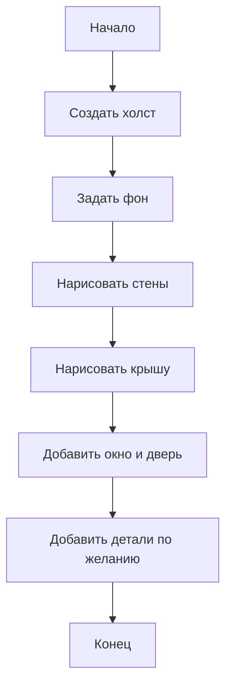

# З-01. Цветной домик


**Класс:** 4  
**Формат:** индивидуальная работа  
**Тип:** 🧩✨ алгоритм + творчество

---

## Кратко

Построй дом из простых фигур на холсте p5.js и сделай его своим: выбери цвета, добавь детали, измени настроение сцены.

---

## Что нужно освоить

- `createCanvas()`
- `rect()`, `triangle()`, `line()`, `ellipse()`
- `fill()`, `stroke()`
- простые переменные
- координаты и размеры

---

## Условие

Нарисуй дом на экране. Обязательный минимум:

1. стены
2. крыша
3. окно
4. дверь

Дополнительно можно добавить:

- трубу
- забор
- солнце
- деревья
- дорогу
- облака

---

## Блок-схема решения



---

## Порядок работы

1. Сначала построй основу дома.
2. Потом добавь крупные детали.
3. Затем укрась сцену.
4. Измени цвета так, чтобы дом имел характер.
5. Проверь, чтобы всё было видно на экране.

---

## Для творчества

Выбери один вариант или придумай свой:

- дом сказочный
- дом на другой планете
- дом в лесу
- дом под водой
- дом будущего

---

## Проверка результата

- Дом целиком виден на холсте.
- У дома есть минимум 4 обязательные части.
- Есть хотя бы 2 элемента, придуманные самостоятельно.
- Сцена выглядит завершённой.

---

## Подсказка

Для аккуратного изображения удобно сначала рисовать большие формы, а потом мелкие детали.

---

## Место для кода

```javascript
function setup() {
  createCanvas(400, 400);
}

function draw() {
  background(200);
}
```
