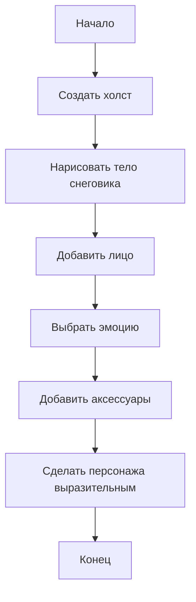

# З-02. Снеговик-характер


**Класс:** 4  
**Формат:** индивидуальная работа  
**Тип:** ✨ творчество + визуальное мышление

---

## Кратко

Измени снеговика так, чтобы у него появился характер: весёлый, грустный, сердитый, задумчивый или совсем необычный.

---

## Что нужно освоить

- `ellipse()`
- `rect()`
- `triangle()`
- `arc()`
- работа с координатами
- простые визуальные детали

---

## Условие

Возьми базовый рисунок снеговика и сделай его выразительным. Обязательный минимум:

1. три части тела
2. глаза
3. нос
4. рот
5. шляпа или другой аксессуар

Дополнительно можно добавить:

- шарф
- пуговицы
- варежки
- метлу
- очки
- наушники

---

## Блок-схема решения



---

## Порядок работы

1. Сначала нарисуй основу снеговика.
2. Потом добавь лицо.
3. Выбери эмоцию и подчеркни её формой рта, глаз и бровей.
4. Добавь предметы, которые помогают раскрыть характер.
5. Проверь, что образ читается сразу.

---

## Для творчества

Выбери один вариант или придумай свой:

- снеговик-путешественник
- снеговик-учёный
- снеговик-музыкант
- снеговик-супергерой
- снеговик-робот

---

## Проверка результата

- Снеговик узнаваем.
- У него есть выражение лица.
- Есть хотя бы 2 детали, которые делают его особенным.
- Образ вызывает эмоцию у зрителя.

---

## Подсказка

Одна и та же фигура может выглядеть по-разному, если изменить глаза, рот и наклон деталей.

---

## Место для кода

```javascript
function setup() {
  createCanvas(400, 400);
}

function draw() {
  background(180, 220, 255);
}
```
