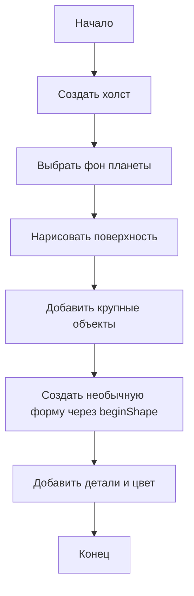

# З-03. Инопланетный пейзаж


**Класс:** 4  
**Формат:** индивидуальная работа  
**Тип:** 🧩✨ алгоритм + творчество

---

## Кратко

Нарисуй инопланетный мир, в котором есть необычная поверхность, странные объекты и хотя бы один элемент, созданный своей формой.

---

## Что нужно освоить

- `ellipse()`
- `rect()`
- `line()`
- `beginShape()`
- `vertex()`
- `endShape()`
- `fill()` и `stroke()`

---

## Условие

Создай фантастический пейзаж на другой планете. Обязательный минимум:

1. поверхность планеты
2. небо или фон
3. не меньше 3 объектов
4. хотя бы 1 объект через `beginShape()`

Дополнительно можно добавить:

- кратеры
- инопланетные растения
- странные горы
- вторую луну
- космический корабль
- светящиеся камни

---

## Блок-схема решения



---

## Порядок работы

1. Придумай, как выглядит твоя планета.
2. Задай фон и линию поверхности.
3. Добавь большие объекты.
4. Создай один необычный объект своей формой.
5. Укрась сцену мелкими деталями.

---

## Для творчества

Выбери один вариант или придумай свой:

- ледяная планета
- вулканическая планета
- планета гигантских грибов
- планета кристаллов
- планета с двумя солнцами

---

## Проверка результата

- На рисунке виден целый пейзаж.
- Есть не меньше 3 объектов.
- Хотя бы один объект нарисован через `beginShape()`.
- Мир выглядит необычно и не похож на земной.

---

## Подсказка

Необычная форма может быть неровной, зубчатой, волнистой или асимметричной — это сразу делает мир фантастическим.

---

## Место для кода

```javascript
function setup() {
  createCanvas(400, 400);
}

function draw() {
  background(40, 20, 80);
}
```
